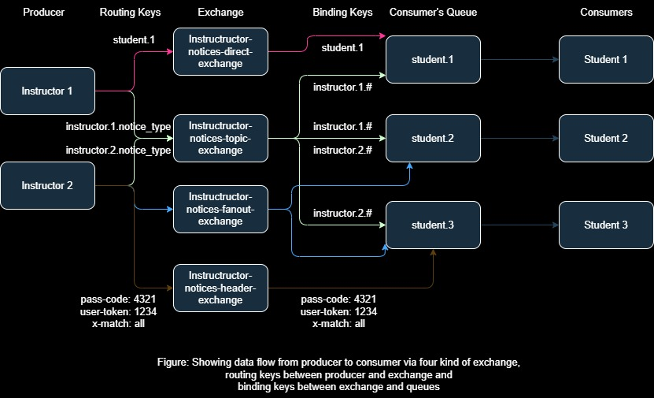

# RabbitMQ
**RabbitMQ** is a message broker software used as an intermediary
between different applications or services to communicate with each other.
One application/service sends messages to the queue and another application/
service receives messages from the queue. To understand RabbitMQ properly,
we need to be familiar with the following topics,
- **Message:** The data being sent from one application/service to another.
  It could be any information such as notifications, commands, objects etc.
- **Queue:** Queue stores messages from the producers and keeps them until consumers
  receive the messages or expire.
- **Producer:** Producer produces or sends a message to the queue.
- **Consumer:** Consumer consumes or receives messages from the queue.
- **Exchange:** Producer sends messages to the exchange and the exchange sends
  those messages to one or more queues based on its routing rule.
- **Binding:** Binding is a rule that links each exchange to a queue.

In RabbitMQ, exchanges are responsible for routing messages to queues
based on certain criteria. There are several types of exchanges,
each with its own routing behaviour. Here are the main types of exchanges:
1. **Direct Exchange**: Direct exchange sends messages to the queues with the same binding key as the messages routing key. For example, if
   binding key of a queue is `something.1.1`, then the direct exchange will send
   message to that queue if the routing key of that message is exactly `something.1.1`.
2. **Topic Exchange**: Topic exchange doesn't have to match the routing key with
   the binding key, instead it follows a wildcard pattern. For that, the routing key
   can have two special characters, `*` and `#` to match exactly one word and
   zero to more than one word accordingly. For example, For example,
   'animal.*' matches 'animal.bird', not 'animal.bird.owl'. Again 'animal.#'
   matches 'animal' or 'animal.bird' or 'animal.bird.owl'.
3. **Fanout Exchange**: Fanout exchange sends the message to all bounded
   queues without considering the routing key.
4. **Headers Exchange**: Headers Exchange sends messages to the queues based
   on the header of messages and queues rather than the routing key.
5. **Default Exchange**: It is a special exchange without any name. It routes
   messages to the queue using the queue name as the routing key. That means Default
   exchange routes messages to the queues having the name same as the routing key of
   those messages.

### Spring Boot and RabbitMQ project

This spring boot complete project is about communication between producer 
and consumer, using four kinds of exchange ( **topic exchange, direct 
exchange, fanout exchange and header exchange** ).

**Scenario:** The system has lots of students and few instructors. Each student
can subscribe to multiple instructors. Instructors can send
notice to his students or a particular student or even all students.

**Design:** I've tried to use four kinds of exchange here.
- Direct Exchange: I used direct exchange while sending notices to individual
students.
- Topic Exchange: While sending a notice to his subscribers.
- Fanout Exchange: To send notices to all students.
- Headers Exchange: While sending notifications to students having the same 
headers key value, I named it sending notices to secure channel.

